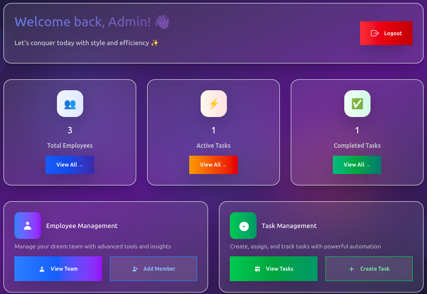
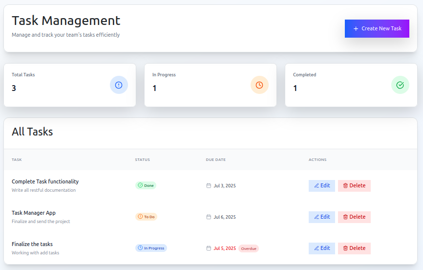

# Simple Task Management System

A full-stack web application built with React frontend and Spring Boot microservices backend, using PostgreSQL as the database.

## 🚀 Tech Stack

### Frontend
- **React** - Frontend framework
- **Vite** - Build tool and development server

### Backend
- **Spring Boot** - Java framework for microservices
- **Maven** - Dependency management
- **Apache Tomcat** - Application server

### Database
- **PostgreSQL** - Primary database (running in Docker container)

### Architecture
- **Microservices Architecture** with 3 independent services:
    - Auth Service (Port 8081)
    - Employee Service (Port 8082)
    - Task Service (Port 8083)

## 📸 Screenshots

### Main Dashboard


### Application Overview


## 🏗️ Project Structure

```
project-root/
├── frontend/
│   ├── src/
│   ├── .env
│   └── package.json
├── backend/
│   ├── auth-service/
│   │   └── src/main/resources/application.properties
│   ├── employee-service/
│   │   └── src/main/resources/application.properties
│   └── task-service/
│       └── src/main/resources/application.properties
├── LICENSE.txt
├── .gitignore
└── README.md
```

## 🔐 Environment Variables

Create a `.env` file in your project root with the following variables:

```env
# Database Configuration
DB_USERNAME=your_username
DB_PASSWORD=your_password
DB_HOST=localhost
DB_PORT=5432

# Frontend API URLs
VITE_AUTH_API_URL=http://localhost:8081/auth
VITE_EMPLOYEE_API_URL=http://localhost:8082/employees
VITE_TASK_API_URL=http://localhost:8083/tasks
```

**Important**: Never commit your `.env` file to version control. Add it to your `.gitignore` file:

```gitignore
.env
*.env
.env.local
.env.development.local
.env.test.local
.env.production.local
```

## 🛠️ Prerequisites

Before running this project, make sure you have the following installed:

- **Java 17+**
- **Node.js 16+ & npm**
- **Maven 3.6+**
- **Docker** (for PostgreSQL database only)
- **IntelliJ IDEA** (recommended)

## 🚀 Getting Started

### 1. Clone the Repository

```bash
git clone <your-repository-url>
cd <project-directory>
```

### 2. Database Setup

Start your PostgreSQL database using Docker:

```bash
# Start PostgreSQL container
docker run --name postgres-db -e POSTGRES_PASSWORD=your_password -p 5432:5432 -d postgres

# Or if you already have a PostgreSQL container
docker start postgres-db
```

### 3. Database Configuration

1. Connect to your PostgreSQL instance:
    - Host: `localhost`
    - Port: `5432`
    - Username: `your_username`
    - Password: `your_password`

2. Create the required databases:
   ```sql
   CREATE DATABASE auth_db;
   CREATE DATABASE employee_db;
   CREATE DATABASE task_db;
   ```

3. In your database management tool, click **Test** and then **Apply** to ensure the connection is working.

### 4. Backend Setup

#### Configure Application Properties

Each microservice has its own `application.properties` file:

**Auth Service** (`/auth-service/src/main/resources/application.properties`):
```properties
spring.application.name=auth-service
server.port=8081
spring.datasource.url=jdbc:postgresql://localhost:5432/auth_db
spring.datasource.username=${DB_USERNAME}
spring.datasource.password=${DB_PASSWORD}
```

**Employee Service** (`/employee-service/src/main/resources/application.properties`):
```properties
spring.application.name=employee-service
server.port=8082
spring.datasource.url=jdbc:postgresql://localhost:5432/employee_db
spring.datasource.username=${DB_USERNAME}
spring.datasource.password=${DB_PASSWORD}
```

**Task Service** (`/task-service/src/main/resources/application.properties`):
```properties
spring.application.name=task-service
server.port=8083
spring.datasource.url=jdbc:postgresql://localhost:5432/task_db
spring.datasource.username=${DB_USERNAME}
spring.datasource.password=${DB_PASSWORD}
```

#### Run Backend Services

1. **Open IntelliJ IDEA** and import the project
2. IntelliJ will automatically detect this as a Maven project and configure Tomcat as the server
3. Start each microservice **one by one** in the following order:

   ```bash
   # Terminal 1 - Auth Service
   cd auth-service
   mvn spring-boot:run
   
   # Terminal 2 - Employee Service  
   cd employee-service
   mvn spring-boot:run
   
   # Terminal 3 - Task Service
   cd task-service
   mvn spring-boot:run
   ```

   Or run them directly from IntelliJ using the Spring Boot run configuration.

4. Verify services are running:
    - Auth Service: http://localhost:8081
    - Employee Service: http://localhost:8082
    - Task Service: http://localhost:8083

### 5. Frontend Setup

#### Environment Configuration

Create a `.env` file in the frontend directory:

```env
VITE_AUTH_API_URL=http://localhost:8081/auth
VITE_EMPLOYEE_API_URL=http://localhost:8082/employees
VITE_TASK_API_URL=http://localhost:8083/tasks
```

#### Run Frontend

```bash
# Navigate to frontend directory
cd frontend

# Install dependencies
npm install

# Start development server
npm run dev
```

The frontend will be available at `http://localhost:5173` (or the port shown in your terminal).

## 🔧 Development Workflow

### Starting the Application

1. **Start PostgreSQL Docker container**
2. **Connect to database** and verify connection
3. **Start backend services** (ports 8081, 8082, 8083)
4. **Start frontend development server**

### Making Changes

- **Backend**: Changes will be automatically reloaded if using Spring Boot DevTools
- **Frontend**: Vite provides hot module replacement for instant updates

## 📝 API Endpoints

### Auth Service (Port 8081)
- `POST /auth/login` - User authentication
- `POST /auth/register` - User registration

### Employee Service (Port 8082)
- `GET /employees` - Get all employees
- `POST /employees` - Create new employee
- `PUT /employees/{id}` - Update employee
- `DELETE /employees/{id}` - Delete employee

### Task Service (Port 8083)
- `GET /tasks` - Get all tasks
- `POST /tasks` - Create new task
- `PUT /tasks/{id}` - Update task
- `DELETE /tasks/{id}` - Delete task

## 🤝 Contributing

1. Fork the repository
2. Create a feature branch (`git checkout -b feature/amazing-feature`)
3. Commit your changes (`git commit -m 'Add some amazing feature'`)
4. Push to the branch (`git push origin feature/amazing-feature`)
5. Open a Pull Request

## 📄 License

This project is licensed under the MIT License - see the [LICENSE](LICENSE.txt) file for details.

## 🆘 Troubleshooting

### Common Issues

1. **Database Connection Issues**
    - Ensure PostgreSQL is running on port 5432
    - Verify database credentials in application.properties

2. **Port Conflicts**
    - Check if ports 8081, 8082, 8083 are available
    - Modify port numbers in application.properties and .env if needed

3. **Service Startup Order**
    - Always start database first
    - Start backend services before frontend
    - Wait for each service to fully start before starting the next

### Logs

Check application logs for detailed error information:
- Backend logs: Available in IntelliJ console or terminal
- Frontend logs: Available in browser developer tools

## 📞 Support

For support, please create an issue in the repository or contact 📧 [Milinda](mailto:milindakarunaratna55@gmail.com)

## 🙏 Acknowledgments

- Thanks to open-source contributors and online communities for libraries, icons, and resources.
- Inspired by the love for cooking and the desire to share amazing recipes with others.
